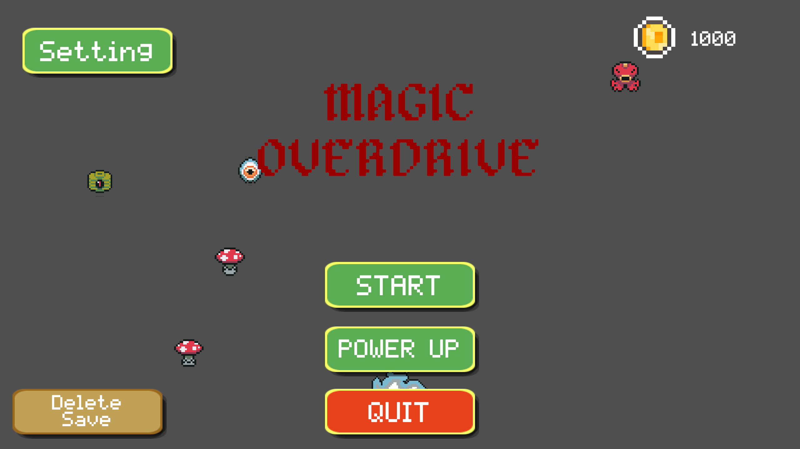
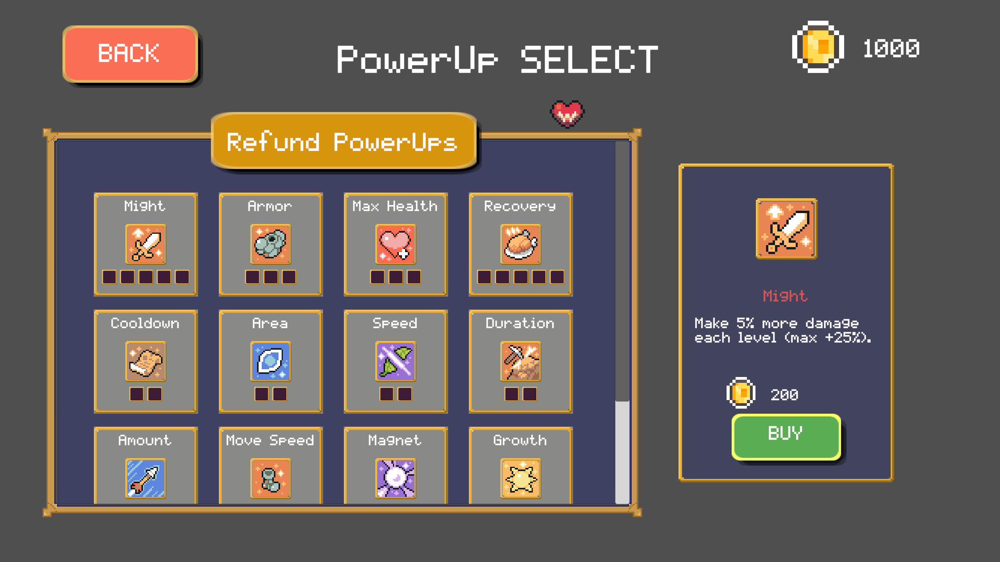
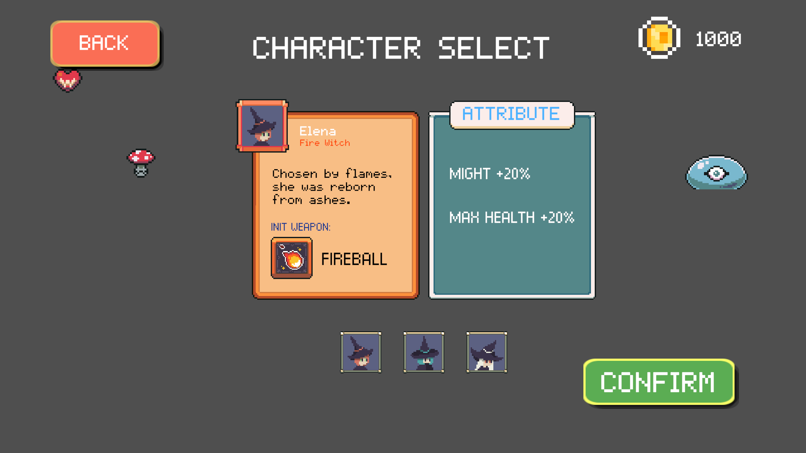
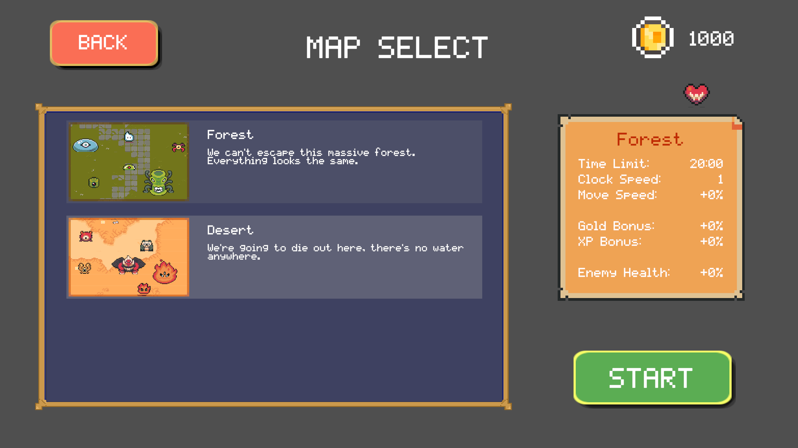
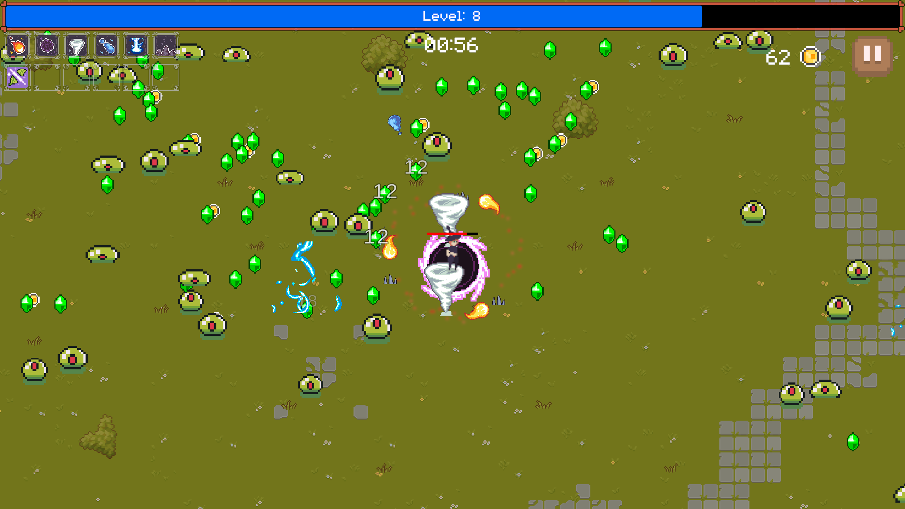
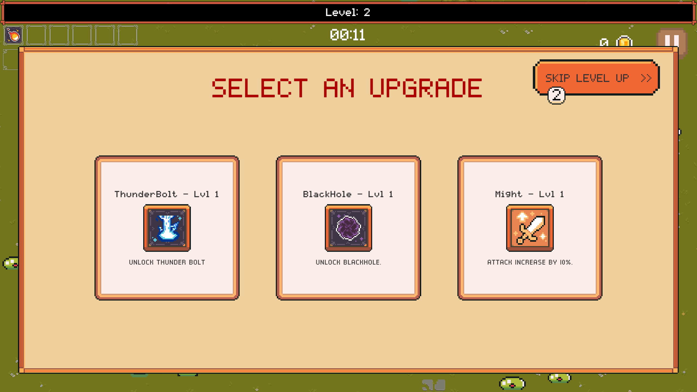
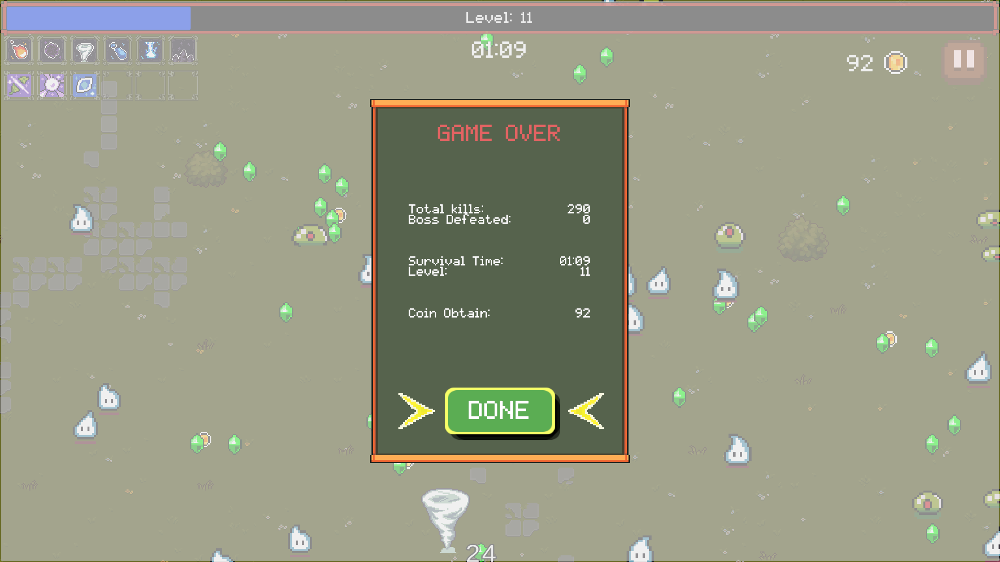

# Magic Overdrive
**Magic Overdrive** es un videojuego **roguelike 2D** con carácter de supervivencia desarrollado en **Unity** para PC.  
El jugador controla a un mago que debe sobrevivir a oleadas de enemigos mientras combina armas, mejora sus atributos y desbloquea nuevas habilidades.  
El proyecto fue desarrollado individualmente como **Trabajo Fin de Grado** del Grado en Ingeniería de Software en la **Universidad Politécnica de Madrid**.

---

## Características principales
- ⚡ **Sistema elemental**: Combina diferentes tipos de armas y efectos para crear estilos de juego únicos.  
- 💎 **Orbes elementales**: Recolecta orbes que aumentan los atributos y permiten evolucionar las armas.  
- 🔥 **Evolución de armas**: Cada arma puede alcanzar niveles superiores o transformarse en una “superarma”.  
- 🧩 **Oleadas progresivas**: Los enemigos se generan de manera dinámica con dificultad creciente.  
- 🌍 **Mapas infinitos**: El escenario se genera de forma modular alrededor del jugador.  
- 🕹️ **Inspirado en Vampire Survivors y Brotato**, combinando sencillez, rejugabilidad y acción constante.

---

## Tecnologías utilizadas
- **Motor**: Unity 2022.3  
- **Lenguaje**: C#  
- **IDE**: Visual Studio Code  
- **Control de versiones**: GitHub  
- **Diseño visual**: Aseprite (pixel art)  
- **Gestión de datos**: Newtonsoft.Json  
- **Arquitectura**: Programación modular con `ScriptableObjects` y `Object Pooling`
  
---

## Instalación y ejecución
Puedes descargar **la versión jugable (Demo)** desde la pestaña [Releases](https://github.com/minwangLou/magic-overdrive/releases/tag/v1.0.0) del repositorio. 

---

## Vídeo de demostración

---

## Capturas de pantalla
| Escena | Imagen |
|:------:|:------:|
| Menú principal |  |
| Selección de mejora |  |
| Selección de personaje |  |
| Selección de mapa |  |
| Partida en curso |  |
| Subida de Nivel |  |
| Fin del Partido |  |

---

## Autor
**Autor:** Minwang Lou  
**Tutor:** Javier Alcalá Casado  
**Universidad:** Universidad Politécnica de Madrid  
**Escuela:** ETS de Ingeniería de Sistemas Informáticos  
**Grado:** Ingeniería del Software  
**Año académico:** 2024–2025  
**Contacto:** [minwang.lou0905@gmail.com](mailto:tu-email@ejemplo.com)

---

## Licencia
Este proyecto se distribuye bajo la **MIT License**.  
Consulta el archivo [LICENSE](LICENSE) para más información.
